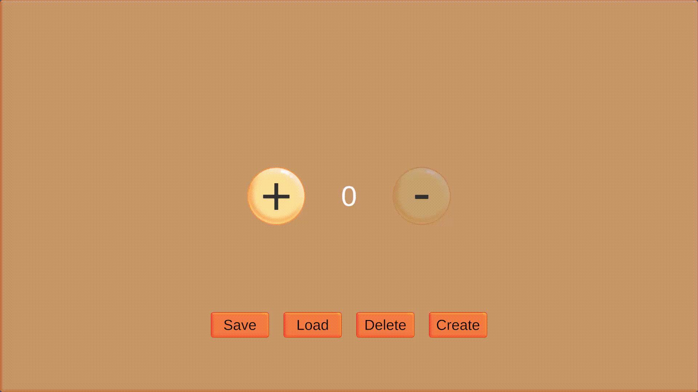

# Save / Load Utility Demo

## Showcase

Unity project demonstrating a reusable save/load utility for persistent game data.

The project focuses on production basics:

- saving and loading serializable data;
- graceful handling of missing or invalid files;
- clear separation between Progress, Meta, Utility and UI layers;
- simple gameplay state represented by Score;
- dependency injection through VContainer;
- reactive state updates through R3.

## Overview

The project contains a small interactive example where the player can change a score value and persist it to disk.

Main user actions:

- Increase score
- Decrease score
- Save progress
- Load progress
- Create new progress
- Delete saved progress

Saved data is written as JSON into Unity's persistent data folder.

---

## Progress Layer

The `Progress` layer is responsible for storing, providing and managing the player's persistent game state.

It contains the data model used for save/load operations, as well as services that create, update, save, load and delete progress. This layer is intentionally separated from UI and gameplay presentation code so that progress logic can be reused and tested independently.

### Responsibilities

The Progress layer handles:

- keeping the current runtime progress state;
- creating a new progress instance;
- loading saved progress from disk;
- saving current progress to disk;
- deleting previously saved progress;
- validating save/load results;
- exposing progress data to other parts of the project.

### Progress Data
Progress data describes what should be saved.

### Progress Provider
The progress provider stores the currently active progress instance during runtime.
Other systems can request progress from the provider instead of loading it directly from disk. This keeps runtime access simple and avoids unnecessary file operations.

### Save / Load Services
Progress services are responsible for the actual persistence workflow:

- create default progress;
- serialize progress to JSON;
- write progress to file;
- read progress from file;
- deserialize JSON back into progress data;
- remove saved progress when needed.

